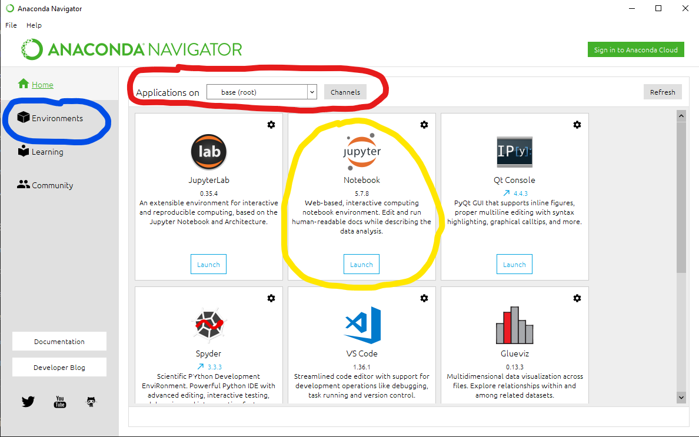
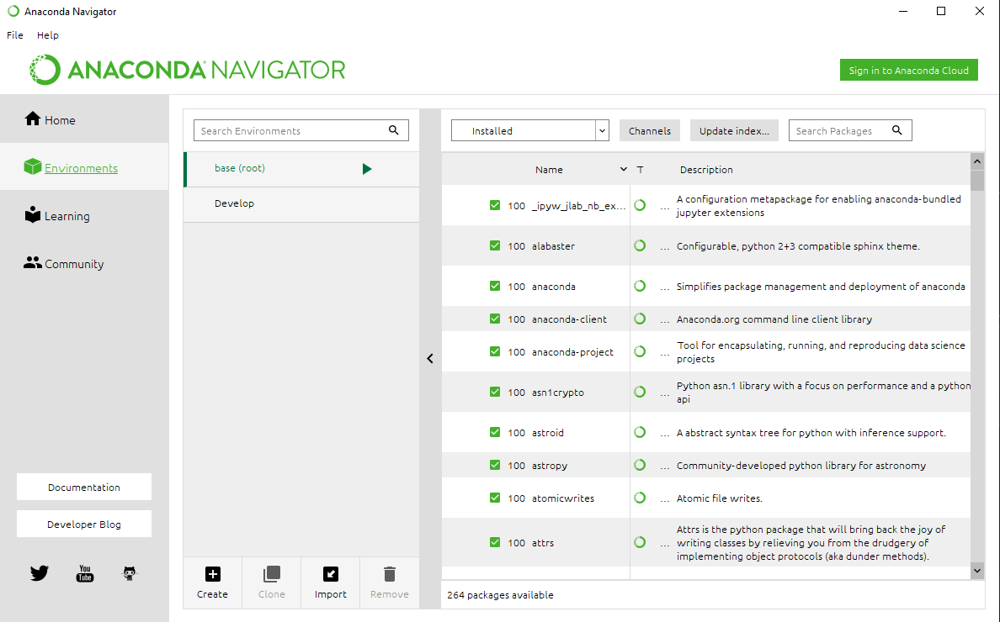

- Cos'è Anaconda
- Installare
- GUI vs linea di comando

Anaconda è una distribuzione open source dei linguaggi di programmazione Python e R ed è utilizzato nella scienza dei dati, nell'apprendimento automatico, nelle applicazioni di apprendimento profondo che mirano a semplificare la gestione e la distribuzione dei pacchetti.

La distribuzione Anaconda è usata da oltre 7 milioni di utenti, e comprende più di 300 pacchetti di scienza dei dati adatti a Windows, Linux e MacOS.

Contiene tutti i pacchetti necessari per iniziare a sviluppare con Python ed è la distribuzione che raccomandiamo perché è molto facile da imparare e da usare.

Se vuoi installare Anaconda scarica la versione 3.X [da qui](https://www.anaconda.com/distribution/)

L'Anaconda ha due tipi di interazione:

- Approccio grafico
- Approccio basato su terminale

L'approccio grafico è con l'Anaconda Navigator una GUI che può aiutare ad utilizzare gli strumenti



Nell'immagine qui sopra puoi vedere alcune parti diverse:

- La parte blu: è dove puoi gestire alcuni diversi ambienti python-conda (ne parleremo nel prossimo cpt.)
- La parte rossa: è dove è possibile modificare gli ambienti installati e le relative app
- La parte gialla: sono le app installate in un ambiente specifico che puoi usare

Se apri la parte blu (ambienti) puoi trovare tutti gli ambienti, tutti i pacchetti e puoi creare nuovi ambienti, pacchetti e librerie o disinstallare e gestire gli altri già in



Il modo migliore per usare anaconda è con il terminale, dopo l'installazione apri CMD (o la tua app terminale) e puoi interagire con Anaconda usando il comando: conda


Ecco qualche utile comando:

- Informazioni sull'installazione di Conda
- Per vedere i tuoi ambienti
- Elenco dei pacchetti nei tuoi ambienti
- Aggiorna anaconda

## Virtual Environments

- Che cos'è un ambiente virtuale
- Crea un nuovo ambiente virtuale
- Installa i pacchetti python in librerie e pacchetti (conda vs pip)
- Cambia ambiente e usa ambienti diversi

Lo scopo principale degli ambienti virtuali Python (chiamato anche venv) è quello di creare un ambiente isolato per i progetti Python.
Ciò significa che ogni progetto può avere le proprie dipendenze, indipendentemente dalle dipendenze di ogni altro progetto.

Nel nostro piccolo esempio qui sopra, avremmo solo bisogno di creare un ambiente virtuale separato sia per ProjectA che ProjectB, e saremmo pronti a partire.
Ogni ambiente, a sua volta, sarebbe in grado di dipendere da qualunque versione di ProjectC scelga, indipendentemente dall'altro.

Il bello di questo è che non ci sono limiti al numero di ambienti che puoi avere dato che sono solo directory che contengono alcuni script.
Inoltre, possono essere facilmente creati utilizzando gli strumenti da riga di comando virtualenv o pyenv.

È possibile creare un ambiente virtuale con Python predefinito, ma utilizziamo ambienti con Anaconda.
Per informazioni standard su Python relative agli ambienti virtuali, [rimandiamo a questo link](https://realpython.com/python-virtual-environments-a-primer/)

Ecco alcuni utili comandi da utilizzare con Anaconda per creare, controllare, validare e aggiornare un Conda Venv

ATTENZIONE: se sei su Windows, usa CMD (come amministratore se possibile) e cerca di evitare Powershell fino a quando non sei sicuro di questa tecnologia

Per visualizzare le informazioni di Conda sull'installazione

```Bash
# visualizza informazioni sull'installazione di conda
conda -v
```

Controllare che Anaconda sia aggiornato

```bash
# aggiornare conda
conda update conda
```

**Crea un nuovo ambiente virtuale (venv) con una specifica versione di Python** \
Ricorda di sostituire x.x con la tua versione di Python (usiamo principalmente la versione 3.6) e "yourenvname" con il nome del tuo ambiente

```Bash
# crea un nuovo ambiente virtuale
conda create -n <nome_ambiente> python = x.x anaconda
```

Se vuoi creare un ambiente vuoto senza le librerie di conda predefinite puoi creare un nuovo ambiente senza l'etichetta anaconda:

```Bash
# crea un ambiente vuoto senza le librerie di conda pre-installate
conda create -n <nome_ambiente> python = x.x
```

Attivare l'ambiente di Anaconda

```bash
# Attivare uno specifico ambiente
conda activate <nome_ambiente>
```

Per installare un nuovo pacchetto (una nuova libreria) nel tuo nuovo ambiente puoi lanciare il seguente comando

```Bash
# Installa un nuovo pacchetto (libreria)
conda install -n <nome_ambiente> <nome_pacchetto>
```

Se hai già attivato il tuo ambiente conda puoi semplicemente fare:

```Bash
# Installa un nuovo pacchetto (libreria) da dentro l'ambiente
conda install <nome_pacchetto>
```

Per uscire dal proprio ambiente virtuale

```Bash
# esci da un ambiente attivato
conda deactivate
```

Se si desidera eliminare l'ambiente virtuale anaconda

```Bash
# rimuovere un ambiente virtuale
conda remove -n <nome_ambiente> -all
```

Se vuoi vedere i tuoi ambienti virtuali anaconda installati

```Bash
# Visualizzare elenco ambienti conda installati
conda env list
```

Se vuoi rimuovere il tuo ambiente conda

```Bash
# rimuovere uno specifico ambiente conda
conda remove --name <nome_ambiente> --all
```

Esistono 2 tipi di scenari che è possibile seguire per installare nuovi pacchetti o librerie Python in Conda:

- Usando pip
- Usando conda

Entrambi sono due gestori di librerie, il primo è il gestore python predefinito e il secondo è il gestore predefinito di Anaconda.
Le librerie disponibili da entrambi i gestori possono essere diversi, quindi ti suggeriamo di utilizzare entrambi i managers ma dando la priorità all'uso di Conda.

AVVERTENZA: se si utilizza pip, è necessario che l'ambiente sia attivato ed essere al suo interno.

Se vuoi qualche altra informazione vedi questo articolo (specialmente se vuoi usare un file requisito.yml personalizzato per le tue librerie Python)

[Articolo su come iniziare con python environment su conda](https://towardsdatascience.com/getting-started-with-python-environments-using-conda-32e9f2779307)
