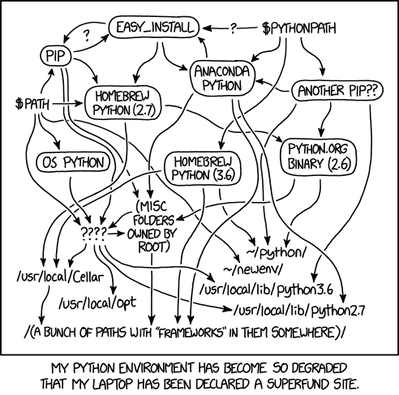

# Gestire diverse versioni di Python
In questa prima sezione vediamo come gestire le proprie installazioni di python all’interno della macchina sfruttando: **pyenv**




---
## **Pyenv**

### Overview

Pyenv consente di gestire diverse versioni di python installate nella vostra macchina, consentendo di gestirle in modo molto semplice e veloce.

È semplice e non troppo invasivo, inoltre potete utilizzarlo su qualsiasi sistema operativo

* Consente di cambiare la versione globale di python oppure locale per ogni progetto o utente
* Consente di gestire una versione locale di ogni progetto con la propria specifica versione di python
* Permette di fare override della versione di Python come variabili d’ambiente (non dovete più gestirle a mano)
* Consente di ricercare diverse versioni di python e gestirle (con tox)

### Alcuni aspetti molto importanti

* Non ci sono problemi di bootstrap, è costruito utilizzando script shell puri
* Non è necessario caricarlo all’interno della propria shell, basta inserire la sua directory nelle variabili di ambiente e funziona “da solo”
* Consente inoltre (ed eventualmente) di gestire in moldo più efficiente i virtualenviroments
* [Documentazione](https://github.com/pyenv/pyenv) fatta molto bene con moltissimo supporto online.

### Comandi utili

```
pyenv install --list

# Installare una specifica versione di python
pyenv install 3.7.4

# Visualizzare tutte le versioni installate (di pyenv)
pyenv versions

# Impostare una determinata versione di python globale (usata da tutto il sistema operativo)
pyenv global 3.7.4

# Impostare una versione di python locale
pyenv local 3.7.4 #viene creato un .python-version file
# Cancellando il file .python-version si cancella la versione locale
rm .python-version

#Cambiare la versione solamente per la sessione di shell esistente
pyenv shell system
```

Con pyenv abbiamo risolto il problema di cambiare velocemente e in modo efficace la versione di python installata sulla propria macchina.

Rimane il problema di gestire le dipendenze (le librerie) all’interno di progetti diversi.

Python ha un grande problema: non si possono avere versioni multiple della stessa libreria (package) installata in una determinata versione di Python.

Ecco che entrano in gioco i **virtualenvironments**

È importante utilizzare separati virtualenvs per ogni progetto che si fa su python, iniziando ad esercitarsi da quelli più semplici.

---

## **Pyenv avanzato**

In questa sezione avanzata sono presenti appunti, best practice e guide per approfondire tutto ciò che riguarda Pyenv

### Documentazione utile

https://realpython.com/intro-to-pyenv/

Pyenv con poetry

https://blog.jayway.com/2019/12/28/pyenv-poetry-saviours-in-the-python-chaos/

Guida per configurare pyenv su Mac

https://opensource.com/article/20/4/pyenv

Notes su un Github Gist

https://gist.github.com/Geoyi/f55ed54d24cc9ff1c14bd95fac21c042

Pyenv è un gestore di installazione di python. Permette di installare e eseguire più installazioni di python sulla stessa macchina.
Pyenv gestisce le differenti versioni di python per te, in modo da evitare il chaos di dipendenze, versioni e installazioni illustrato nell’immagine iniziale.

**Perchè non utilizzare python installato di default nel proprio sistema operativo?**

Perchè possono creare problemi nei progetti, ognuno ha la propria versione e ci possono essere problemi di migrazione e riproducibilità quando si usano in contesti di produzione.


### Cosa ci consente di fare pyenv? (flusso operativo)

1. installare Python nel proprio user space
2. installare versioni multiple di python
3. specificare quale esatta versione di python utilizzare per un progetto e/o attività
4. cambiare tra le diverse versioni installate facilmente

#### Installare Pyenv

Per installare Pyenv vi rimandiamo alla documentazione ufficiale su Github.
Questo perchè le modalità di installazione cambiano a seconda della versione e del sistema operativo e stare al passo con gli aggiornamenti è sempre complicato.

Più avanti in questa guida trovate esempi di utilizzo con Pyenv più avanzati.

La guida di riferimento per l’installazione la potete trovare: qui

Verificare installazione di Pyenv

Una volta installato e configurato correttamente sul vostro terminale terminale fare:

```
pyenv --version
```

#### Installare Python

Visualizzare le versioni di python

```
pyenv install --list | grep " 3\.[678]"
```
```
pyenv install -v 3.7.2
```

Visualizzare dove vengono installate le varie versioni su Python
```
ls ~/.pyenv/versions/
```

Disinstallare una versione di Python
```
pyenv uninstall <version>
```

Ogni volta che su windows (e altri sistemi operativi) si installa una nuova versione di Python con pyenv è importante anche fare rehash
```
#rehash to update shims
pyenv rehash
```

#### Usare una versione di Pyenv
```
#Visualize the installed (available) versions
pyenv versions

#Visualize the active version of python with pyenv
pyenv which python

#Set a global pyenv version
pyenv global <version>

#If you want to come back to the system default
pyenv global system
```

È anche possibile impostare una versione di pyenv python locale per ogni progetto facendo all’interno della cartella di progetto:

```
pyenv local <version>
```
Oppure impostare la versione di una determinata shell

```
pyenv shell <version>
```

**IMPORTANTE IN WINDOWS 10**
Dopo aver installato la versione di Python global di pyenv è necessario eliminare dalla variabile di ambiente PATH i riferimenti al Python base installato inizialmente.

#### Virtualenvs con pyenv
Pyenv ha un bellissimo plugin chiamato: pyenv-virtualenv che consente di gestire appunto i vari virtualenv in modo semplice.

Ci sono diversi modi per gestire un virtualenv (pyenv consente di gestirli tutti e 3 in modo molto semplice e comodo)

* pyenv manages multiple versions of Python itself.
* virtualenv/venv manages virtual environments for a specific Python version.
* pyenv-virtualenv manages virtual environments for across varying versions of Python.

Creare un virtualenv
```
pyenv virtualenv <python_version> <environment_name>

#<pythonversion> is optional
```

Attivare un virtualenv

```
pyenv local myproject

#verify python version
pyenv which python

#verify pip version
pyenv which pip
```

È quindi possibile attivare o disattivare un particolare ambiente (virtualenv) (un po' come succede con anaconda)
```
pyenv activate <environment_name>

pyenv deactivate
```

Con pyenv è anche possibile utilizzare più versioni di python contemporaneamente…

**Bonus: utilizzare oh-my-zsh**
È possibile utilizzare pyenv come plugin su oh-my-zsh in modo molto comodo inserendo pyenv all’interno dei plugin nel file di configurazione.

Informazione: Impedire a conda di partire di default

```
conda config --set auto_activate_base false
```